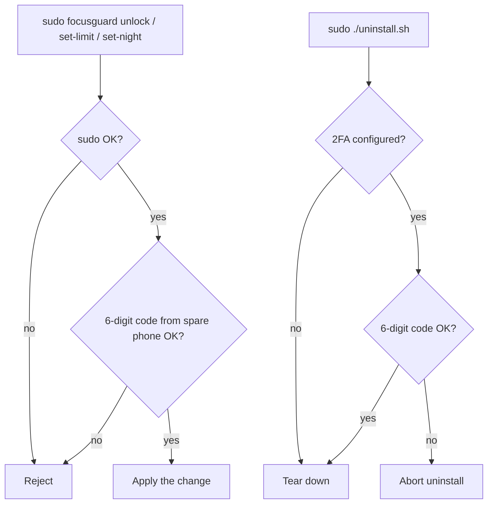

# FocusGuard

The point is friction you set up in advance. You put the authenticator code on a
phone you deliberately keep out of easy reach: a spare handset in a drawer, an
old phone at the office, a friend's phone. You scan a QR code onto it once. After
that, changing a daily limit or lifting a block needs the current 6-digit code
from that device, so the moment you want to bend your own rules you have to
physically go and get it. That small errand is usually enough to stop you. The
project itself is open and free: read it, run it, change it however you like.

A website/app blocker for macOS that works across every browser (including
DuckDuckGo's `duck://player`). A per-user LaunchAgent reads the active tab via
the Accessibility API; the root LaunchDaemon blocks via `/etc/hosts`. Two jobs,
because reading the screen needs your session and editing `/etc/hosts` needs
root.

## What it does

Out of the box, with the default config:

- **YouTube**: 1 hour/day cap. After 60 minutes of cumulative use, blocked
  until midnight. Also blocked between **22:30 and 08:00** every night. Plain
  `youtube.com` is DNS-blocked via `/etc/hosts`; DuckDuckGo's `duck://player`
  embed streams from a wildcard CDN that hosts can't touch, so when a blocked
  YouTube/Duck Player tab is frontmost the browser is force-quit instead.
- **Spotify**: blocked between **22:30 and 08:00** every night: both the web
  player (via `/etc/hosts`) and the desktop app (force-quit each tick). No time
  counting, just the night window.
- Lifting or weakening any block needs `sudo` + a 2FA code (see
  [Second factor](#second-factor-2fa)).

## Install

1. Open Terminal, `cd` to the folder with these files.
2. Make the scripts executable:

   ```bash
   chmod +x install.sh uninstall.sh focusguard.py
   ```

3. Run the installer:

   ```bash
   sudo ./install.sh
   ```

   It'll prompt for your sudo password, then offer to set up the 2FA
   authenticator code (recommended: it's the gate for unlock/uninstall/limit
   changes). The whole point is friction.

4. **One-time Accessibility grant.** The installer triggers the prompt; if you
   miss it, go to `System Settings → Privacy & Security → Accessibility` and
   enable `/usr/local/bin/fg-axurl` (add with `+`). Without it, usage tracking
   can't see YouTube; the night-block still works.

That's it. The daemon runs every minute, edits `/etc/hosts` based on schedule
+ usage, and survives reboots.

## Daily use

```bash
focusguard status                  # usage and what's blocked (no sudo)
focusguard selftest                # built-in logic checks (no sudo)
sudo focusguard unlock 30          # unlock for 30 min
sudo focusguard lock               # re-lock right now
sudo focusguard setup-2fa          # enable/re-seed the authenticator code
sudo focusguard set-limit youtube 90   # change a daily limit
sudo focusguard set-night 23:00 07:00  # change the night window
```

`status` and `selftest` need nothing; everything that lifts or weakens a block
(`unlock`, `set-limit`, `set-night`, `uninstall`) needs `sudo` + the 2FA code.

## Customize sites & schedule

The two everyday knobs have dedicated, 2FA-gated commands (see above):
`set-limit <site> <minutes>` and `set-night <start> <end>`. For anything else
(adding sites, domains, patterns, apps), edit `/usr/local/etc/focusguard/config.json`:

```json
{
  "night_block": { "start": "22:30", "end": "08:00" },
  "sites": {
    "youtube": {
      "domains": ["youtube.com", "www.youtube.com", "youtube-nocookie.com", ...],
      "url_patterns": ["youtube.com", "youtu.be", "youtube-nocookie", "googlevideo", "duck://player"],
      "daily_limit_minutes": 60,
      "night_block": true
    },
    "spotify": {
      "domains": ["open.spotify.com", "spotify.com"],
      "url_patterns": ["open.spotify.com", "spotify.com"],
      "apps": ["Spotify"],
      "daily_limit_minutes": 0,
      "night_block": true
    }
  }
}
```

- `domains`: blocked in `/etc/hosts` (page loads).
- `url_patterns`: substrings matched against the active tab's URL/title to meter usage.
- `apps`: native macOS process names force-quit while the site is blocked (omit for web-only).
- `daily_limit_minutes: 0` means no limit; `night_block: false` exempts the site.
- The night window can wrap midnight (start later than end).

Changes take effect on the next tick (~60s).

## Second factor (2FA)

The two factors are **sudo** and a **TOTP code** (Google Authenticator / Authy
on a spare phone): there is no separate FocusGuard password. Anything that
lifts or weakens a block flows like this:



`sudo focusguard setup-2fa` prints a key + QR; scan it into the authenticator on
the spare phone. The seed lives in a root-only file
(`/usr/local/etc/focusguard/totp.secret`), so it's friction, not a vault: a
`sudo` user can read or delete it. Deleting it is also your **break-glass if you
lose the phone** (re-seeding while 2FA is configured needs a current code):

```bash
sudo rm /usr/local/etc/focusguard/totp.secret   # disables 2FA
sudo focusguard setup-2fa                        # re-seed with a new phone
```

## What it can't do

Be honest with yourself about these:

- **Foreground only.** Counting and the browser-quit fire only when the site's
  window is frontmost; background or picture-in-picture playback isn't seen.
- **Sampled every 60s.** Granularity is one minute, and a blocked video can play
  up to a minute before the next tick quits the browser (which closes its other
  tabs too). Instant per-flow cutoff would need a signed content filter (not used).
- **Anyone with sudo can undo it** by editing `/etc/hosts` or revoking the grant.
  This is friction, not military-grade enforcement.

## Uninstall

```bash
sudo ./uninstall.sh
```

Asks for a current 2FA code (if configured), then restores `/etc/hosts` and
removes the daemon, agent, helper, and all FocusGuard files. A `sudo` user can
still tear it down by hand, bypassing the prompt.

## Where everything lives

| Path                                                  | What it is              |
| ----------------------------------------------------- | ----------------------- |
| `/usr/local/bin/focusguard`                           | the script              |
| `/usr/local/bin/fg-axurl`                             | active-tab URL reader   |
| `/usr/local/etc/focusguard/config.json`               | your config             |
| `/usr/local/etc/focusguard/totp.secret`               | 2FA seed (root-only 0600)|
| `/usr/local/var/focusguard/state.json`                | today's usage + unlock  |
| `/usr/local/var/focusguard/active.txt`                | active tab (agent → daemon)|
| `/usr/local/var/focusguard/focusguard.log`            | daemon logs             |
| `/Library/LaunchDaemons/com.focusguard.daemon.plist`  | root daemon (blocking)  |
| `/Library/LaunchAgents/com.focusguard.agent.plist`    | per-user reader (metering)|
| `/etc/hosts`                                          | page-load block list    |
| `/etc/hosts.focusguard-backup`                        | your original hosts file|
