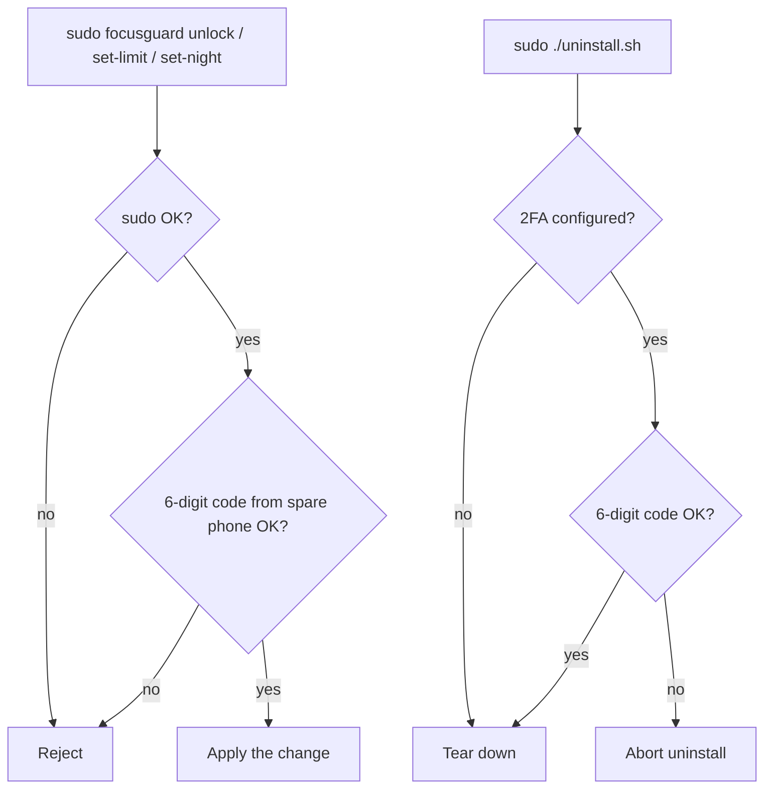

# FocusGuard

A personal website blocker for macOS that actually works across every browser
— including DuckDuckGo browser (and its `duck://player`), Arc, and anything
else without a Cold Turkey extension. Usage is metered by reading the active
browser tab via the macOS Accessibility API (which can see `duck://player` and
the `youtube-nocookie` embeds it uses), and blocking happens at the OS level via
`/etc/hosts`, so the browser can't load the page.

A per-user **LaunchAgent** runs the tab reader inside your GUI login session
(the only place the Accessibility grant is honoured) and writes the active tab
to `active.txt`; the root **LaunchDaemon** reads that file to meter usage and
edit `/etc/hosts`. Two jobs, because reading the screen needs your session and
editing `/etc/hosts` needs root.

## What it does

Out of the box, with the default config:

- **YouTube**: 1 hour/day cap. After 60 minutes of cumulative use, blocked
  until midnight. Also blocked between **22:30 and 08:00** every night. Plain
  `youtube.com` is DNS-blocked via `/etc/hosts`; DuckDuckGo's `duck://player`
  embed streams from a wildcard CDN that hosts can't touch, so when a blocked
  YouTube/Duck Player tab is frontmost the browser is force-quit instead.
- **Spotify**: blocked between **22:30 and 08:00** every night — both the web
  player (via `/etc/hosts`) and the desktop app (force-quit each tick). No time
  counting, just the night window.
- Changing or lifting any of this needs `sudo` (your macOS admin password) plus
  a 2FA authenticator code — for the moments when you *do* legitimately need to
  get to something.

## Install

1. Open Terminal, `cd` to the folder with these files.
2. Make the scripts executable:

   ```bash
   chmod +x install.sh uninstall.sh focusguard.py
   ```

3. Run the installer:

   ```bash
   sudo ./install.sh
   ```

   It'll prompt for your sudo password, then offer to set up the 2FA
   authenticator code (recommended — it's the gate for unlock/uninstall/limit
   changes). The whole point is friction.

4. **One-time Accessibility grant.** Usage tracking reads your active browser
   tab via the Accessibility API. The installer triggers the prompt; if you
   miss it, go to `System Settings → Privacy & Security → Accessibility`,
   click `+`, add `/usr/local/bin/fg-axurl`, and enable it. Without this the
   daily-limit tracking can't see YouTube; the night-block works regardless.

That's it. The daemon runs every minute, edits `/etc/hosts` based on schedule
+ usage, and survives reboots.

## Daily use

```bash
focusguard status                  # see how much YouTube time you have left
sudo focusguard unlock 30          # unlock for 30 min (needs 2FA code)
sudo focusguard lock               # re-lock right now
sudo focusguard setup-2fa          # enable/re-seed the authenticator code
sudo focusguard set-limit youtube 90   # change a daily limit (needs 2FA code)
sudo focusguard set-night 23:00 07:00  # change the night window (needs 2FA code)
```

The two factors are **sudo** (your macOS admin password) and the **2FA code**
from the spare phone. `status` needs neither; everything that lifts or weakens a
block (`unlock`, `set-limit`, `set-night`, `uninstall`) needs both.

Changing a limit or the night window is the part you're most tempted to weaken
in a moment of weakness, so `set-limit` and `set-night` require the 2FA code.
(Honest caveat: a `sudo` user can still bypass this by hand-editing
`config.json` below — the gate only holds if you use the commands.)

## Customize sites & schedule

The two everyday knobs have dedicated, 2FA-gated commands (see above):
`set-limit <site> <minutes>` and `set-night <start> <end>`. For anything else
(adding sites, domains, patterns, apps), edit `/usr/local/etc/focusguard/config.json`:

```json
{
  "night_block": { "start": "22:30", "end": "08:00" },
  "sites": {
    "youtube": {
      "domains": ["youtube.com", "www.youtube.com", "youtube-nocookie.com", ...],
      "url_patterns": ["youtube.com", "youtu.be", "youtube-nocookie", "googlevideo", "duck://player"],
      "daily_limit_minutes": 60,
      "night_block": true
    },
    "spotify": {
      "domains": ["open.spotify.com", "spotify.com"],
      "url_patterns": ["open.spotify.com", "spotify.com"],
      "apps": ["Spotify"],
      "daily_limit_minutes": 0,
      "night_block": true
    }
  }
}
```

- Add more sites by adding more keys under `"sites"`.
- `domains` are blocked in `/etc/hosts` (page loads). `url_patterns` are
  substrings matched against the active tab's URL and title to meter usage.
- `apps` is a list of native macOS app process names (e.g. `"Spotify"`) that
  are force-quit each tick while the site is blocked. Relaunching just gets
  quit again within ~60s. Omit it for web-only sites.
- `daily_limit_minutes: 0` means no per-day limit.
- `night_block: false` means the night window doesn't apply to that site.
- The night window can wrap midnight (start later than end) or stay within
  one day (start earlier than end).

After editing, changes take effect on the next tick (within ~60 seconds).

## Second factor (2FA)

The two factors are **sudo** (your macOS admin password, which root commands
need anyway) and a **TOTP authenticator code** (Google Authenticator / Authy on
a spare phone). There is no separate FocusGuard password — sudo + the code are
the gate. Anything that lifts or weakens a block flows like this:



Enable it (the installer also offers this):

```bash
sudo focusguard setup-2fa
```

It prints a base32 key and an `otpauth://` URI. In Google Authenticator (or
Authy) on the spare phone, choose **Enter a setup key** and type the key in as
"FocusGuard". After that, `unlock`, `set-limit`, `set-night`, and `uninstall.sh`
all require a valid 6-digit code.

The TOTP seed is stored in a root-only file (`/usr/local/etc/focusguard/totp.secret`),
so it is friction, not an unbreakable vault: a `sudo` user can still read or
delete the seed. That deletion is also your **break-glass if you lose the phone**:

```bash
sudo rm /usr/local/etc/focusguard/totp.secret   # disables 2FA
sudo focusguard setup-2fa                        # re-seed with a new phone
```

Re-seeding while 2FA is still configured requires a current code, so resetting
is a deliberate root file operation, not a casual one-command bypass.

## What it can't do

Be honest with yourself about these:

- **Foreground only.** Usage counts (and the browser-quit enforcement fires)
  only when the window showing the site is frontmost. A video playing in a
  background window or picture-in-picture won't count — the active tab is what's
  read each tick.
- **Usage is sampled every 60 seconds.** A minute counts if the active tab
  matches during the tick, so granularity is one minute.
- **No instant mid-stream cut.** `/etc/hosts` blocks page loads/reloads, and the
  browser-quit only fires on the next tick (≤60s) while a blocked tab is
  frontmost — so a playing video can run for up to a minute before the browser
  is quit. Quitting also closes your other tabs in that browser. True per-flow
  mid-stream cutoff would need a signed content filter (not used).
- **A determined adult with sudo** can edit `/etc/hosts` or revoke the
  Accessibility grant and undo any block. The friction is the point, not
  military-grade enforcement.

## Uninstall

```bash
sudo ./uninstall.sh
```

If 2FA is configured, it first asks for a current authenticator code and aborts
on a wrong one. Then it restores `/etc/hosts` from backup, removes the daemon,
the per-user agent, and the `fg-axurl` helper, and deletes all FocusGuard files.
Clean. (A `sudo` user can still tear it down manually, bypassing this prompt —
see the friction-not-vault note above.)

## Where everything lives

| Path                                                  | What it is              |
| ----------------------------------------------------- | ----------------------- |
| `/usr/local/bin/focusguard`                           | the script              |
| `/usr/local/bin/fg-axurl`                             | active-tab URL reader   |
| `/usr/local/etc/focusguard/config.json`               | your config             |
| `/usr/local/etc/focusguard/totp.secret`               | 2FA seed (root-only 0600)|
| `/usr/local/var/focusguard/state.json`                | today's usage + unlock  |
| `/usr/local/var/focusguard/active.txt`                | active tab (agent → daemon)|
| `/usr/local/var/focusguard/focusguard.log`            | daemon logs             |
| `/Library/LaunchDaemons/com.focusguard.daemon.plist`  | root daemon (blocking)  |
| `/Library/LaunchAgents/com.focusguard.agent.plist`    | per-user reader (metering)|
| `/etc/hosts`                                          | page-load block list    |
| `/etc/hosts.focusguard-backup`                        | your original hosts file|
